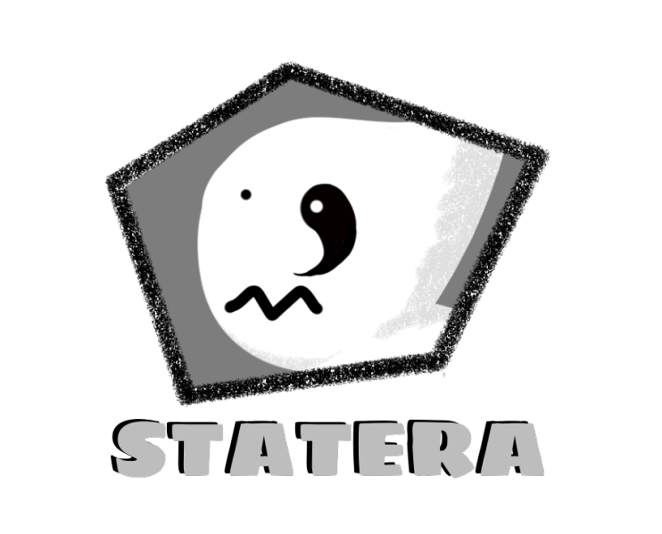

  

There is a nearly forgotten order of balance keepers. More specifically, lost and found socks, balance keepers. 

In this game you will play as the next one and your objective is to keep the balance between items lost in the darkness and found back to light until you era is completed, and then you can finally rest.

## Playing 🕹

URL: https://alanpcs.itch.io/statera

Controls:
- Pick item / drop item: spacebar
- Move:  ⬆ ⬅ ⬇ ➡ / w a s d

## Context
Game created during the Global Game Jam 2021 within 48h.

It is not an AAA game, but making it was a lot of fun 🙌 

## Credits

### Development

203 corgis team
- [Leticia Pasdiora](https://github.com/leticiap)
- [Alan Peterson](https://github.com/alanpcs)

### Sound effects and music:
- Felix Thorn
- Fupicat
- JarredGibb
